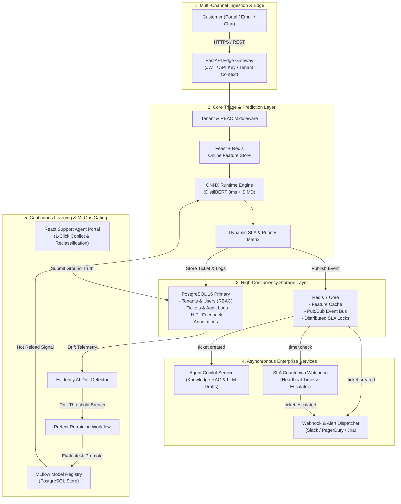
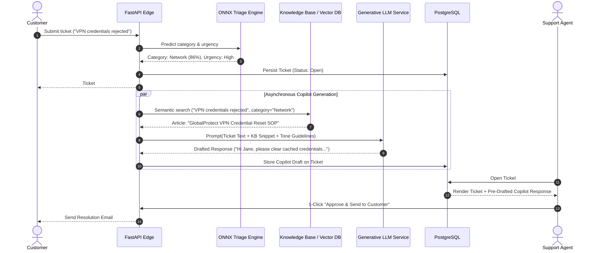
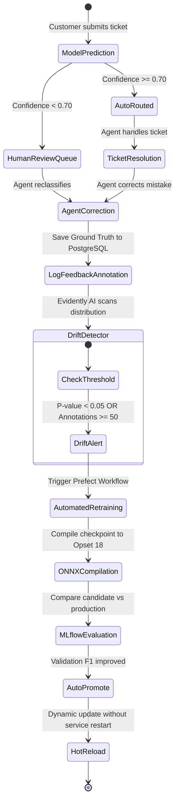
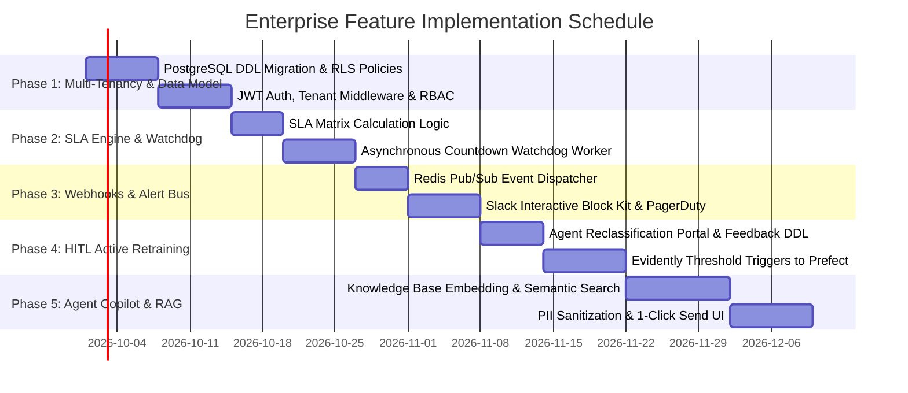

# Enterprise Architecture Specification: Support Ticket Triage & Routing System
**Document Version:** 1.0.0  
**Classification:** Enterprise Engineering Architecture Blueprint  
**Target Platform:** Production Multi-Tenant SaaS (Zendesk / ServiceNow Enterprise Grade)  
**Target Tech Stack:** FastAPI, PyTorch + ONNX Runtime, PostgreSQL 16, Redis 7, MLflow, Prefect, Evidently AI, Docker & Kubernetes (Helm / ArgoCD)

---

## Table of Contents
1. [Executive Summary & Enterprise SaaS Vision](#1-executive-summary--enterprise-saas-vision)
2. [End-to-End System Architecture](#2-end-to-end-system-architecture)
3. [Multi-Tenancy & Role-Based Access Control (RBAC)](#3-multi-tenancy--role-based-access-control-rbac)
4. [Agent Copilot & Generative AI Draft Responses](#4-agent-copilot--generative-ai-draft-responses)
5. [Event-Driven Alerting & Integrations (Slack, PagerDuty, Webhooks)](#5-event-driven-alerting--integrations-slack-pagerduty-webhooks)
6. [Human-in-the-Loop (HITL) Feedback & Continuous Active Learning](#6-human-in-the-loop-hitl-feedback--continuous-active-learning)
7. [SLA Breach Watchdog & Automated Escalation Engine](#7-sla-breach-watchdog--automated-escalation-engine)
8. [Complete Enterprise Database Schema (PostgreSQL 16 DDL)](#8-complete-enterprise-database-schema-postgresql-16-ddl)
9. [Enterprise REST API Specification](#9-enterprise-rest-api-specification)
10. [Implementation Roadmap & Milestones](#10-implementation-roadmap--milestones)

---

## 1. Executive Summary & Enterprise SaaS Vision

The **Support Ticket Triage & Routing System** transitions from a localized machine learning inference microservice into a complete **Enterprise AI-Native Customer Experience & IT Service Management (ITSM) Platform**.

### Core Business Objectives
* **Autonomous Triage Rate:** Automatically classify and route $\ge 85\%$ of incoming tickets without human touch.
* **Resolution Acceleration:** Reduce Mean Time to Resolution (MTTR) by up to $70\%$ through instant ONNX inference ($<10\text{ ms}$) and Generative Copilot draft responses.
* **Zero Unmonitored Drift:** Real-time Evidently AI drift scoring combined with an automated Human-in-the-Loop (HITL) ground-truth feedback loop.
* **Contractual SLA Enforcement:** Dynamic SLA policy calculation backed by an asynchronous countdown watchdog preventing costly SLA penalties.
* **Enterprise Security & Compliance:** Multi-tenant logical isolation, JWT-based Role-Based Access Control (RBAC), and immutable audit logs.

---

## 2. End-to-End System Architecture

The platform follows a **Hexagonal (Ports & Adapters) Event-Driven Microservices Architecture**, separating synchronous low-latency inference from background event processing and continuous retraining.



---

## 3. Multi-Tenancy & Role-Based Access Control (RBAC)

Enterprise organizations require strict tenant separation, enabling multiple client companies or distinct internal business units (e.g., HR, IT, Finance) to operate within the same platform while guaranteeing data isolation.

### 3.1 Tenant Isolation Strategy
* **Logical Data Partitioning:** Every database table includes an indexed `tenant_id UUID NOT NULL` column.
* **Row-Level Security (RLS):** PostgreSQL policies automatically enforce:
  ```sql
  CREATE POLICY tenant_isolation_policy ON tickets
  FOR ALL
  USING (tenant_id = NULLIF(current_setting('app.current_tenant_id', true), '')::UUID);
  ```
* **Context Propagation:** FastAPI dependency injection extracts the tenant ID from the authenticated JWT token or dedicated API Key and sets the local connection session context before running any query.

### 3.2 Role Hierarchy & Permissions Matrix

| Role | Description | Key Permissions |
| :--- | :--- | :--- |
| **SuperAdmin** | Platform operator managing the infrastructure. | `manage:tenants`, `manage:system`, `view:all_metrics` |
| **TenantAdmin** | Company administrator managing their organization. | `manage:users`, `manage:sla_policies`, `manage:webhooks`, `view:reports` |
| **TriageLead** | Lead support engineer overseeing routing and ML quality. | `override:ticket_route`, `trigger:retraining`, `audit:model_decisions` |
| **SupportAgent**| Daily responder handling assigned tickets. | `read:assigned_tickets`, `update:ticket_status`, `send:copilot_draft` |
| **Auditor** | Read-only compliance officer. | `read:audit_logs`, `view:compliance_reports` |
| **APIIntegration**| Machine-to-machine bot token (e.g. Jira / Slack). | `create:tickets`, `receive:webhooks` |

---

## 4. Agent Copilot & Generative AI Draft Responses

Support agents spend an average of $60\%$ of their shift writing repetitive boilerplate responses. The **Agent Copilot** combines the deterministic ONNX category & priority predictions with **Retrieval-Augmented Generation (RAG)** grounded in company documentation.



### 4.1 Safety & PII Sanitization
Before transmitting ticket context to any generative language model:
1. **PII Masking:** Regex and NER models detect and mask Credit Card numbers, Social Security Numbers, API keys, and email addresses:
   $$\text{"My card is 4111-2222-3333-4444"} \longrightarrow \text{"My card is [REDACTED_CARD]"}$$
2. **Deterministic Fallback:** If the model's classification confidence is $< 0.60$, the Copilot skips generation and flags the ticket for manual review.

---

## 5. Event-Driven Alerting & Integrations (Slack, PagerDuty, Webhooks)

When an urgent incident occurs (e.g., severe security breach or datacenter outage), waiting for an agent to notice a dashboard is unacceptable. The platform uses a **Redis Pub/Sub Event Bus** to dispatch alerts immediately.

### 5.1 Real-Time Slack Interactive Block Kit
When a ticket is classified as `Urgency: Critical` or `Category: Access & Security`:
* The platform pushes a rich interactive message to the configured Slack channel (`#incident-response`):

```json
{
  "channel": "#incident-response",
  "blocks": [
    {
      "type": "header",
      "text": {"type": "plain_text", "text": "🚨 CRITICAL INCIDENT AUTO-TRIAGED"}
    },
    {
      "type": "section",
      "fields": [
        {"type": "mrkdwn", "text": "*Ticket ID:*\n#TCK-9402"},
        {"type": "mrkdwn", "text": "*Priority:*\nP1 - Critical (SLA: 1 hour)"},
        {"type": "mrkdwn", "text": "*Assigned Team:*\nSecurity Operations Center (SOC)"},
        {"type": "mrkdwn", "text": "*Confidence:*\n94.8% (ONNX DistilBERT)"}
      ]
    },
    {
      "type": "section",
      "text": {"type": "mrkdwn", "text": "*Customer:* Acme Global (VIP Tier)\n*Summary:* Production database credentials compromised in git push."}
    },
    {
      "type": "actions",
      "elements": [
        {
          "type": "button",
          "text": {"type": "plain_text", "text": "Acknowledge Incident"},
          "style": "primary",
          "action_id": "ack_ticket"
        },
        {
          "type": "button",
          "text": {"type": "plain_text", "text": "Reassign to Tier 3"},
          "style": "danger",
          "action_id": "escalate_ticket"
        }
      ]
    }
  ]
}
```

### 5.2 PagerDuty Incident Dispatch
* Tickets with `target_sla_hours <= 1` trigger the PagerDuty `Events API v2`:
  - `routing_key`: Tenant-specific service key.
  - `event_action`: `trigger`.
  - `dedup_key`: `tenant_id:ticket_id`.

### 5.3 Outbound Webhooks with HMAC-SHA256 Signatures
* External consumers receive Webhook notifications (`ticket.created`, `ticket.routed`, `ticket.sla_breached`).
* Headers include:
  ```http
  X-Triage-Signature: sha256=5d41402abc4b2a76b9719d911017c592...
  X-Triage-Delivery-Id: 9f848b61-4fa2-4f26-89d8-c1e1bc6386df
  X-Triage-Timestamp: 1726982400
  ```

---

## 6. Human-in-the-Loop (HITL) Feedback & Continuous Active Learning

Model degradation occurs when customers begin submitting tickets with new terminology (e.g. new software version releases, changed billing policies).



### 6.1 Feedback Ingestion Mechanics
Whenever an agent reclassifies a ticket in the UI:
1. An immutable record is inserted into `agent_feedback_annotations`:
   - `original_predicted_category`
   - `corrected_ground_truth_category`
   - `original_confidence`
   - `reclassification_reason`
2. If `confidence >= 0.85` but was corrected by the agent, it is flagged as a **High-Confidence False Positive**, receiving $3\times$ sample weight during the next retraining cycle.

---

## 7. SLA Breach Watchdog & Automated Escalation Engine

Enterprise Service Level Agreements define strict response and resolution thresholds based on **Customer Tier** and **Issue Priority**.

### 7.1 Dynamic SLA Matrix

| Priority | VIP Enterprise Tier | Business Tier | Standard / Free Tier |
| :---: | :---: | :---: | :---: |
| **P1 - Critical** | **30 Minutes** | **1 Hour** | 4 Hours |
| **P2 - High** | **2 Hours** | **4 Hours** | 12 Hours |
| **P3 - Medium** | **6 Hours** | **12 Hours** | 24 Hours |
| **P4 - Low** | **12 Hours** | **24 Hours** | 48 Hours |

### 7.2 SLA State Machine & Escalator Worker
An asynchronous background daemon (running every $30$ seconds) monitors active tickets:
* **75% Elapsed Time Warning:** Fires an event `ticket.sla_warning`. Dispatches Slack notification to the assigned team lead.
* **100% Breached:** Updates ticket state to `Status: Breached`. Fires `ticket.sla_breached`, reassigns ticket to `Tier 3 Escalations`, and triggers an incident webhook.

---

## 8. Complete Enterprise Database Schema (PostgreSQL 16 DDL)

Below is the complete, production-grade schema DDL to be applied to the primary PostgreSQL instance.

```sql
-- ============================================================================
-- 1. EXTENSIONS & ENUMS
-- ============================================================================
CREATE EXTENSION IF NOT EXISTS "uuid-ossp";
CREATE EXTENSION IF NOT EXISTS "pgcrypto";

CREATE TYPE tenant_plan_enum AS ENUM ('STARTER', 'GROWTH', 'ENTERPRISE');
CREATE TYPE user_role_enum AS ENUM ('SUPERADMIN', 'TENANT_ADMIN', 'TRIAGE_LEAD', 'SUPPORT_AGENT', 'AUDITOR', 'BOT');
CREATE TYPE ticket_status_enum AS ENUM ('OPEN', 'PENDING_AGENT', 'RESOLVED', 'CLOSED', 'BREACHED');
CREATE TYPE priority_enum AS ENUM ('P1_CRITICAL', 'P2_HIGH', 'P3_MEDIUM', 'P4_LOW');
CREATE TYPE customer_tier_enum AS ENUM ('FREE', 'STANDARD', 'BUSINESS', 'VIP_ENTERPRISE');

-- ============================================================================
-- 2. TENANTS & MULTI-TENANCY
-- ============================================================================
CREATE TABLE tenants (
    tenant_id UUID PRIMARY KEY DEFAULT uuid_generate_v4(),
    slug VARCHAR(64) UNIQUE NOT NULL,
    company_name VARCHAR(255) NOT NULL,
    plan tenant_plan_enum NOT NULL DEFAULT 'GROWTH',
    is_active BOOLEAN NOT NULL DEFAULT TRUE,
    created_at TIMESTAMP WITH TIME ZONE DEFAULT CURRENT_TIMESTAMP,
    updated_at TIMESTAMP WITH TIME ZONE DEFAULT CURRENT_TIMESTAMP
);

CREATE INDEX idx_tenants_slug ON tenants(slug);

-- ============================================================================
-- 3. USERS & RBAC MEMBERSHIP
-- ============================================================================
CREATE TABLE users (
    user_id UUID PRIMARY KEY DEFAULT uuid_generate_v4(),
    tenant_id UUID NOT NULL REFERENCES tenants(tenant_id) ON DELETE CASCADE,
    email VARCHAR(255) NOT NULL,
    password_hash VARCHAR(255) NOT NULL,
    full_name VARCHAR(255) NOT NULL,
    role user_role_enum NOT NULL DEFAULT 'SUPPORT_AGENT',
    is_active BOOLEAN NOT NULL DEFAULT TRUE,
    created_at TIMESTAMP WITH TIME ZONE DEFAULT CURRENT_TIMESTAMP,
    UNIQUE(tenant_id, email)
);

CREATE INDEX idx_users_tenant_email ON users(tenant_id, email);

-- ============================================================================
-- 4. SLA POLICIES
-- ============================================================================
CREATE TABLE sla_policies (
    policy_id UUID PRIMARY KEY DEFAULT uuid_generate_v4(),
    tenant_id UUID NOT NULL REFERENCES tenants(tenant_id) ON DELETE CASCADE,
    priority priority_enum NOT NULL,
    customer_tier customer_tier_enum NOT NULL,
    target_response_minutes INT NOT NULL,
    target_resolution_minutes INT NOT NULL,
    warning_threshold_pct NUMERIC(3, 2) NOT NULL DEFAULT 0.75,
    UNIQUE(tenant_id, priority, customer_tier)
);

-- ============================================================================
-- 5. TICKETS & AI TRIAGE METADATA
-- ============================================================================
CREATE TABLE enterprise_tickets (
    ticket_id UUID PRIMARY KEY DEFAULT uuid_generate_v4(),
    tenant_id UUID NOT NULL REFERENCES tenants(tenant_id) ON DELETE CASCADE,
    external_ticket_id VARCHAR(128),
    title VARCHAR(512),
    description TEXT NOT NULL,
    customer_id VARCHAR(128) NOT NULL,
    customer_tier customer_tier_enum NOT NULL DEFAULT 'STANDARD',
    status ticket_status_enum NOT NULL DEFAULT 'OPEN',
    
    -- AI Classification Metadata
    predicted_category VARCHAR(64) NOT NULL,
    confidence NUMERIC(5, 4) NOT NULL,
    probabilities JSONB NOT NULL,
    assigned_team VARCHAR(128) NOT NULL,
    assigned_agent_id UUID REFERENCES users(user_id) ON DELETE SET NULL,
    priority priority_enum NOT NULL DEFAULT 'P3_MEDIUM',
    auto_routed BOOLEAN NOT NULL DEFAULT FALSE,
    model_version VARCHAR(64) NOT NULL,
    latency_ms NUMERIC(8, 2) NOT NULL,
    
    -- SLA Tracking
    sla_response_deadline TIMESTAMP WITH TIME ZONE NOT NULL,
    sla_resolution_deadline TIMESTAMP WITH TIME ZONE NOT NULL,
    sla_warning_emitted BOOLEAN NOT NULL DEFAULT FALSE,
    first_responded_at TIMESTAMP WITH TIME ZONE,
    resolved_at TIMESTAMP WITH TIME ZONE,
    
    -- Copilot Assistant Draft
    copilot_suggested_response TEXT,
    copilot_confidence NUMERIC(5, 4),
    copilot_sources JSONB,
    
    created_at TIMESTAMP WITH TIME ZONE DEFAULT CURRENT_TIMESTAMP,
    updated_at TIMESTAMP WITH TIME ZONE DEFAULT CURRENT_TIMESTAMP
);

CREATE INDEX idx_tickets_tenant_status ON enterprise_tickets(tenant_id, status);
CREATE INDEX idx_tickets_deadlines ON enterprise_tickets(sla_resolution_deadline) WHERE status = 'OPEN';
CREATE INDEX idx_tickets_created_at ON enterprise_tickets(created_at);

-- ============================================================================
-- 6. HUMAN-IN-THE-LOOP (HITL) FEEDBACK ANNOTATIONS
-- ============================================================================
CREATE TABLE agent_feedback_annotations (
    feedback_id UUID PRIMARY KEY DEFAULT uuid_generate_v4(),
    tenant_id UUID NOT NULL REFERENCES tenants(tenant_id) ON DELETE CASCADE,
    ticket_id UUID NOT NULL REFERENCES enterprise_tickets(ticket_id) ON DELETE CASCADE,
    agent_id UUID NOT NULL REFERENCES users(user_id) ON DELETE CASCADE,
    
    original_category VARCHAR(64) NOT NULL,
    corrected_category VARCHAR(64) NOT NULL,
    original_priority priority_enum NOT NULL,
    corrected_priority priority_enum NOT NULL,
    
    model_version VARCHAR(64) NOT NULL,
    original_confidence NUMERIC(5, 4) NOT NULL,
    reclassification_reason TEXT,
    is_used_in_retraining BOOLEAN NOT NULL DEFAULT FALSE,
    created_at TIMESTAMP WITH TIME ZONE DEFAULT CURRENT_TIMESTAMP
);

CREATE INDEX idx_feedback_tenant_retrained ON agent_feedback_annotations(tenant_id, is_used_in_retraining);

-- ============================================================================
-- 7. EVENT AUDIT LOG
-- ============================================================================
CREATE TABLE ticket_audit_events (
    event_id UUID PRIMARY KEY DEFAULT uuid_generate_v4(),
    tenant_id UUID NOT NULL REFERENCES tenants(tenant_id) ON DELETE CASCADE,
    ticket_id UUID NOT NULL REFERENCES enterprise_tickets(ticket_id) ON DELETE CASCADE,
    actor_id UUID REFERENCES users(user_id) ON DELETE SET NULL,
    event_type VARCHAR(64) NOT NULL, -- 'AUTO_ROUTED', 'COPILOT_GENERATED', 'SLA_WARNING', 'AGENT_CORRECTION'
    event_payload JSONB NOT NULL,
    created_at TIMESTAMP WITH TIME ZONE DEFAULT CURRENT_TIMESTAMP
);

CREATE INDEX idx_audit_ticket_events ON ticket_audit_events(tenant_id, ticket_id, created_at);

-- ============================================================================
-- 8. OUTBOUND WEBHOOK SUBSCRIPTIONS
-- ============================================================================
CREATE TABLE webhook_subscriptions (
    subscription_id UUID PRIMARY KEY DEFAULT uuid_generate_v4(),
    tenant_id UUID NOT NULL REFERENCES tenants(tenant_id) ON DELETE CASCADE,
    target_url VARCHAR(1024) NOT NULL,
    secret_token VARCHAR(255) NOT NULL,
    events_subscribed TEXT[] NOT NULL, -- ARRAY['ticket.created', 'ticket.sla_breached', 'ticket.reclassified']
    is_active BOOLEAN NOT NULL DEFAULT TRUE,
    created_at TIMESTAMP WITH TIME ZONE DEFAULT CURRENT_TIMESTAMP
);
```

---

## 9. Enterprise REST API Specification

All enterprise routes require authentication and tenant context.

### 9.1 Ingestion & Triage Endpoints
* **`POST /api/v2/tickets`**
  - Ingests a new ticket from external integrations.
  - Automatically executes ONNX classification, computes dynamic SLAs, saves the ticket, and initiates asynchronous Copilot drafting.
* **`POST /api/v2/tickets/{ticket_id}/copilot/generate`**
  - Forces generation or regeneration of the Agent Copilot draft response using RAG.
* **`POST /api/v2/tickets/{ticket_id}/feedback`**
  - **HITL Endpoint:** An agent submits a reclassification ground-truth correction.
  - Logs the event and increments the active retraining counter.

### 9.2 SLA & Escalation Endpoints
* **`GET /api/v2/tickets/sla-at-risk`**
  - Returns all open tickets currently past the $75\%$ SLA warning threshold.
* **`POST /api/v2/tickets/{ticket_id}/escalate`**
  - Manually or automatically reassigns an overdue ticket to Tier 3 Incident Management.

### 9.3 Webhook Management Endpoints
* **`POST /api/v2/webhooks/subscriptions`**
  - Registers a new tenant destination (e.g. Slack incoming webhook or corporate incident API).

---

## 10. Implementation Roadmap & Milestones



### Milestone Deliverables

#### Milestone 1: Enterprise Multi-Tenancy & RBAC Core
1. Apply the PostgreSQL DDL schema (`tenants`, `users`, `enterprise_tickets`).
2. Integrate Tenant-Context and Role-Based dependency injection into FastAPI routes.
3. Validate strict logical tenant data isolation with unit tests.

#### Milestone 2: SLA Countdown Engine & Dynamic Escalations
1. Implement the SLA matrix calculator mapping `(CustomerTier, Priority) -> SLA Deadlines`.
2. Deploy the Celery/Redis watchdog service checking approaching deadlines every 30s.
3. Verify automatic escalation to Tier 3 when deadline expires.

#### Milestone 3: Event-Driven Slack & Webhook Dispatcher
1. Wire `ticket.created`, `ticket.sla_warning`, and `ticket.sla_breached` events to Redis Pub/Sub.
2. Build the interactive Slack Block Kit bot enabling 1-click incident claiming.
3. Deploy HMAC-signed outbound webhook delivery with retry guarantees.

#### Milestone 4: HITL Continuous Active Learning Loop
1. Add ticket reclassification and ground-truth correction actions to the React Agent Portal.
2. Wire `agent_feedback_annotations` directly into Evidently AI drift monitors.
3. Automate Prefect retraining pipelines to trigger whenever 50 corrections accumulate.

#### Milestone 5: Generative Agent Copilot with Knowledge RAG
1. Ingest corporate standard operating procedures (SOPs) into vector storage.
2. Build the PII-masking preprocessor and Generative Copilot draft assistant.
3. Deliver the 1-click "Approve & Send" Agent Copilot review drawer in the Frontend UI.
